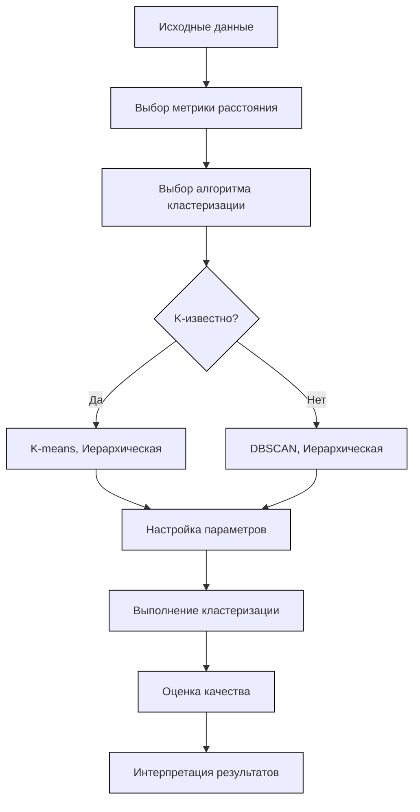

# Тема 1. База
## Типы данных

### Дискретные 
Целые значения.
Обычно результат счёта.
### Непрерывные
float / диапазон.
Обычно результат измерения

### Порядковые
Их нельзя складывать, но можно упорядочить.
S < M < L < XL < XXL
(Label encoding)
### Номинальные
Их нельзя складывать и сравнивать
Бензин $\cancel{ < }$ Дизель
(OneHot encoding)
## Понятие однородности / неоднородности данных
### Бытовое определение
#### Однородные данные
- Имеют одинаковую природу
Сигнал, звук, изображение, изменение по времени какой-либо величины и т.д.
#### Неоднородные
- Смесь типов данных (числовые + категориальные)
- Данные из разных источников (разные страны)
- Данные с разным масштабом (сотни тысяч и десятки единиц)

### Определение в ML
#### Однородные данные
- Каждая строка — независимый объект
- Порядок строк не важен (перемешивание не меняет свойства данных)
- Нет временных или пространственных зависимостей
- Все данные из одного распределения
#### Неоднородные
- Временные зависимости (порядок дней)
- Пространственные зависимости (изображение)
- Групповые зависимости (измерения внутри одного пациента зависимы)
- Разные распределение (данные собраны в разных условиях)
### Как бороться с неоднородностью?
- **Для временных рядов:** Использовать специальные методы валидации (временные разбиения)
- **Для пространственных данных:** Учитывать пространственные autocorrelation
- **Для групповых данных:** Использовать групповую валидацию (GroupKFold)
- **Для разных распределений:** Техники domain adaptation (Перенос знаний с модели на модель)

## Методы предобработки данных
### Missing data
Пропущенные значения
- **Удаление**
	- Потеря информации
- **Заполнение**
	- **Числовые:** Среднее, медиана, мода
	- **Категориальные:** мода или категория *Unknown*
### Encoding
Перевод категориальных данных в количественные
- **Label Ecoding**
	- М, Ж = 0, 1
		- Кодируем каждый признак целым числом
	- Модель может решить, что между числами есть порядок
- **One-Hot encoding**
	- М, Ж = [1, 0], [0, 1]
		- Каждая координата отвечает за конкретное значение. В данном случае первый столбец - $is\_М$, второй - $is\_Ж$
	- Проклятие размерности
		- При большом количестве категорий матрица становится разреженной и большой, увеличивается риск переобучения
### Масштабирование и нормализация
Уменьшение масштаба данных.
- **Стандартизирование**
	- $\dfrac{x - \mu}{\sigma}$
	- Сведение к среднему $\mu = 0$ и стандартному отклонению $\sigma = 1$
- **Min-max**
	- $\dfrac{x - \min}{\max - \min}$
	- Приведение значений к диапазону [0, 1]
	- *Сохраняет исходное распределение*
### Преобразование признаков
Создание новых признаков из существующих для лучшего описания закономерностей.
- **Полиномиальные признаки**
	- Для учёта нелинейных зависимостей
	- $x^{2},\ x^{3},\ x_{1}\cdot x_{2}$
- **Дискретизация**
	- Перевод непрерывного признака в категориальный / интервальный.
	- возраст → [0-18, 19-65, 66+]
- **Извлечение признаков**
	- **Из дат:** день недели, месяц, является ли выходным 
	- **Из текста:** длина, наличие ключевых слов
	- **Из взаимодействия признаков:** вычисление значений нового признака из нескольких других по формулам (цена, делённая на площадь, разность между выручкой и расходами и т. д.).
### Работа с выбросами
Убирание значений, сильно отклоняющихся от остальных наблюдений.
- **Ящик с усами**
	- Берём 25 и 75 перцентиль; отнимаем / прибавляем $1.5 \cdot \operatorname{IQR}$ (интерквартильный размах) (a. k. a. делаем усы); Смотрим, что будет вне границ
		- $\begin{cases}x< Q_{1} - 1.5 \cdot \operatorname{IQR}\ \\ x> Q_{3} + 1.5 \cdot \operatorname{IQR}\end{cases}$ 
- **Z-score** метод (для нормально распределённого признака)
	- Признак приводят к стандартному нормальному распределению ($Z = \dfrac{X - \mu}{\sigma}$);
	- Определяют порог ($threshold$) (обычно 99.7% квантиль, т. е. $threshold = 3$);
	- Все значения, выходящие за заданный порог, считаются выбросами
		- $\begin{cases}Z > threshold \\ Z < -threshold\end{cases}$

Можем удалить, заменить на предельное значение или же как-то их преобразовать.
## Типы задач, решаемых ИИ
### C учителем

Есть размеченные данные. Пытаемся предсказать правильный ответ

#### Формальная постановка

$D$ - множество пар $(x_i, y_i), \text{ где } x_i \in X, y_i \in Y$,

$L(Y, Y) \to \mathbb{R}$ - функция ошибки,

$M(\xi, X) \to Y$ - модель, $\xi$ - вектор параметров модели.

Тогда задача обучения с учителем - задача поиска вектора $\xi^*$, такого что:
$$L(Y, M(\xi^*, X)) = L(Y, \hat Y) \to \min$$

#### **Задачи:**
- **Регрессия**
- **Классификация**
	- Бинарная, многоклассовая
- **Сегментация**
	- Разделение изображения на смысловые области
- **Ранжирование**
	- Упорядочивание объектов

### Без учителя

Нет размеченных данных. Ищем скрытые структуры

#### Формальная постановка задачи кластеризации

$X$ - множество объектов.

Пусть функция $\underline{L}: (X_1, X_2, \ldots, X_n) \to \mathbb{R}, \enspace (\overline{L}: (X_1, X_2, \ldots, X_n) \to \mathbb{R})$ - внутренняя метрика (внешняя метрика).

$M(\xi, X) \to (X_1, X_2, \ldots, X_n)$ - модель, $\xi$ - вектор параметров модели.

Тогда задача кластеризации - поиск $\xi$, такого что

$$
X_1, X_2, \ldots, X_n: \underline{L}(X_1, X_2, \ldots, X_n) \to \min
$$
или
$$
X_1, X_2, \ldots, X_n: \overline{L}(X_1, X_2, \ldots, X_n) \to \max
$$

#### **Задачи:**
- **Кластеризация**
	- Группировка похожих объектов
- **Понижение размерности**
	- Сокращение числа признаков
- **Детекция аномалий**
	- Поиск выбросов
- **Генерация**
	- Создание новых данных (GAN)

### С частичным контролем

Мало размеченных данных + много неразмеченных
- Обычно небольшое количество размеченных данных и большое количество неразмеченных.
- Неразмеченные данные помогают понять структуру пространства, а размеченные - определить границы классов

### Обучение с подкреплением

Агент учится взаимодействовать со средой и получает "награды" за правильные действия

У среды есть множество всевозможных состояний $S$.
У агента - множество возможных действий $A$.
Функция награды за выбранное действие $a$ в состоянии $s$, из-за которого среда перешла в состояние $s'$. 

## Формальная постановка задач
1. **Какие данные есть / могут быть получены?**
2. **Какой тип величины мы можем прогнозировать на основе данных?**
	1. Определение вида задачи
3. **Какой характер данных и зависимостей в них?**
	1. Структура данных, зависимости и их характер
4. **Какие у нас есть ресурсы (технические и человекоресурсы)?**
	1. Время обучения, память, GPU
	2. Эксперты для разметки данных и компетенции команды в ML
	3. Требования к точности и интерпретируемости
	4. Стоимость ошибки (FP, FN)
		1. Лучше, чтобы мы не дали кредит, чем дали и потеряли его.

### Пример формальной постановки
**Задача**: Прогноз оттока клиентов банка
1. **Данные**:
    - 100K клиентов, 50 признаков (возраст, баланс, количество операций)
    - Есть пропуски в данных о доходе
2. **Целевая переменная**:
    - Бинарная: ушел/не ушел (классификация)
3. **Характер данных**:
    - Табличные данные, временные ряды операций
    - Наблюдения независимы (i.i.d.)
    - Признаки: числовые + категориальные
4. **Ресурсы**:
    - Сервер с 16ГБ RAM
    - Модель должна давать ответ < 1 секунды
    - Важна интерпретируемость (чтобы понимать причины оттока)

# Тема 2. Регрессия
https://education.yandex.ru/handbook/ml/article/linear-models
## Постановка регрессии как задачи оптимизации

Пусть дан датасет $(X, y)$, где $y \in \mathbb{R}^N$ - вектор целевой переменной, а $X \in \mathbb{R}^{N \times M}$ - матрица $M$ признаков.

Задача состоит в подборе линейной функции, "наилучшим образом" моделирующую линейную зависимость ($y = kx + b$) значения таргета $y_i$ от фичи $x_i$. Тогда искомая функция будет иметь вид:
$$f(w,x_i) = (w, x_i) = w_0 + w_1 x_{i1} + w_2 x_{i2} + \cdots + w_M x_{iM} = \hat{y_{i}}$$

Формулировку "наилучшим образом" в данном контексте можно выразить например с помощью Евклидовой нормы:
$$L(f, X, y)=\dfrac{1}{N}\| y - f(w,X) \|^2=\dfrac{1}{N} \sum \limits _{k=1}^N (y_k - (w, x_k))^2$$
Линейная модель тем "лучше" моделирует зависимость чем меньше значение функционала $L$, а значит задача сводится нахождении вектора весов $w^*$, доставляющего минимум функционалу:
$$L_f(w)=\| y - f(w,X) \|^2 \to \underset{w}{\min}$$

## Метрики и функции ошибки задач регрессии

**Функция ошибки** - функционал, используемый во время процесса оптимизации параметров
**Метрика** - функция, оценивающая результат, предсказанный моделью

### Функции ошибок

**1) MSE (Mean Squared Error)**
$$\operatorname{MSE}(y, \hat{y}) = \dfrac{1}{N}\sum\limits_{k=1}^N (y_k - \hat{y_k})^2$$

**2) MAE (Mean Absolute Error)**
$$\operatorname{MAE}(y, \hat{y}) = \dfrac{1}{N}\sum\limits_{k=1}^N |y_k - \hat{y_k}|$$

### Метрики качества

Довольно часто MSE и MAE используют как метрики. Однако на их базе существуют еще несколько метрик:

**1) RMSE**
Квадратный корень MSE

**2) Коэффициент детерминации**
$$R^2 = 1- \dfrac{\sum\limits_{k=1}^N (y_k - \hat{y_k})^2}{\sum\limits_{k=1}^N (y_k - \overline{y})^2}$$
где $\overline{y}$ - среднее обучающей выборки (наилучшее константное предсказание с точки зрения MSE)

**3) MAPE (Mean Absolute Percentage Error)**
$$\operatorname{MAPE}(y, \hat{y}) = \dfrac{1}{N}\sum\limits_{k=1}^N \dfrac{|y_k - \hat{y_k}|}{|y_k|}$$

### Интерпретируемость и применимость метрик

**Интерпретируемость модели** - возможность объяснить её результаты заказчику

**1) MSE**
Интерпретируемость: метрика не ограничена сверху и возвращает значение на порядок большее, чем в данных, из-за чего её сложнее интерпретировать

Применимость: когда выбросов мало и их нужно сильно штрафовать

**2) RMSE**
Интерпретируемость: метрика теперь имеет тот же порядок, что и у данных, потому проще оценить разброс

Применимость: аналогична MSE

**3) MAE**
Интерпретируемость: средняя абсолютная ошибка

Применимость: когда выбросов много (метрика менее им подвержена, производная - константа).

**4) $R^2$**
Интерпретируемость: показывает, какую долю дисперсии, которую модель смогла предсказать
$R^2 = 1$ - идеальная модель
$R^2 = 0$ - предсказывает не лучше константного среднего
$R^2 < 0$ - предсказывает хуже чем просто среднее

Применимость: когда хотим сравнить модели на одном и том же наборе данных, желательно вместе с другими метриками. 

**5) MAPE**
Интерпретируемость: средняя ошибка в процентах

Применимость: метрика сильнее штрафует отрицательные величины, данные не должны содержать нули

## Вывод аналитического решения задачи линейной регрессии в векторной форме
при дифференцировании первое слагаемое можно сжато
$$
X_{n \times k} = \begin{pmatrix} 
x_{11} & x_{12} & \ldots &  x_{1k} \\
x_{21} & x_{22} & \ldots & {x_{2k}} \\ 
\vdots  & \vdots & \ddots & \vdots \\ 
x_{n1} & x_{k2} & \ldots & x_{n k}
\end{pmatrix}
$$
$$
\omega = \pmatrix{
\omega_{1} \\
\vdots \\
\omega_{k}
} \quad 
y = \pmatrix{
y_{1} \\
\vdots \\
y_{n}
}
$$
$$
\hat{y} = X \omega
$$
**Функция потерь**
$$
L = (X\omega - y)^{2} \to \min
$$

Преобразуем функцию потерь
$$
L = (X\omega-y)^{T} (X\omega-y) = (X\omega)^{T}X\omega - (X\omega)^{T} y - y^{T}X\omega + y^{T}y
$$

**Используя свойства векторной алгебры получаем тождества**
1. $y^{T}X\omega = (X\omega)^{T}y = \omega^{T}X^{T}y$
2. $(X\omega)^{T}X\omega = \omega^{T} X^{T} X \omega$

С учетом этих свойств, функция потерь принимает вид
$$
L = \omega^{T}X^{T}X\omega - 2\omega^{T}X^{T}y + y^{T}y
$$
Перейдем к решению задачи минимизации. Для этого продифференцируем функцию потерь по вектору весов
$$
\dfrac{dL}{d\omega} = \dfrac{d}{d\omega} \omega^{T}X^{T}X\omega -2 \dfrac{d}{d\omega}\omega^{T}X^{T}y + \dfrac{d}{d\omega}y^{T}y = L_{1} -2 L_{2} + L_{3}
$$
---
$$
w^{T}X^{T}Xw = w^{T} A w = (w_{1},\ldots, w_{k}) \pmatrix{
a_{11} && \ldots && a_{1k} \\
\vdots && \ddots && \vdots \\
a_{k1} && \ldots && a_{kk}
} \pmatrix{w_{1} \\ \vdots \\ w_{k}} =
$$
$$
= \pmatrix{
a_{11}w_{1} + \ldots + a_{k1} w_{k} ,~ \ldots ,~ a_{1k}w_{1} + \ldots + a_{kk} w_{k}
} \pmatrix{w_{1} \\ \vdots \\ w_{k}} =
$$
$$
= w_{1}(a_{11}w_{1} + \ldots + a_{k1} w_{k}) + \ldots + w_{k}(a_{1k}w_{1} + \ldots + a_{kk} w_{k}) = \sum\limits_{i=1}^{k} a_{ii} w^{2}_{i} + 2 \sum\limits_{i=1}^{k - 1} \sum\limits_{j=i+1}^{k} a_{ij} w_{i} w_{j}
$$
$$
\dfrac{d}{dw_{2}}\pmatrix{
a_{11}w_{1}^{2} && a_{12}w_{1}w_{2} && \ldots && a_{1k}w_{1}w_{k} \\
a_{21}w_{2}w_{1} && a_{22}w_{2}^{2} && \ldots && a_{2k}w_{2}w_{k} \\
\vdots && \vdots && \ddots && \vdots \\
a_{k1}w_{k}w_{1} && a_{k2}w_{k}w_{2} && \ldots && a_{kk}w_{k}^{2}
} = 2\sum \limits_{ i = 1 }^{ k  } a_{2i}\cdot w_{i} 
$$
Получили квадратичную форму с матрицей $A$. 
С учетом этого получаем
$$
L_{1} = \pmatrix{
2\sum\limits_{i=1}^{k} a_{i1}w_{i} \\
2\sum\limits_{i=1}^{k} a_{i2}w_{i} \\
\vdots \\
2\sum\limits_{i=1}^{k} a_{ik}w_{i}
} = 2A\omega = 2X^{T}X\omega
$$
---
$$
w^{T}X^{T}y = (w_{1}, \ldots, w_{k}) \pmatrix{
x_{11}y_{1} + \ldots + x_{n1} y_{n} \\
\vdots \\
x_{1k}y_{1} + \ldots + x_{nk} y_{n}
} = 
$$
$$
= w_{1} (x_{11}y_{1} + \ldots + x_{n1}y_{n}) + \ldots + w_{k} (x_{1k}y_{1} + \ldots + x_{nk} y_{n})
$$
Таким образом
$$
L_{2} = \pmatrix{
x_{11}y_{1} + \ldots + x_{n1} y_{n} \\
\vdots \\
x_{1k}y_{1} + \ldots + x_{nk} y_{n}
} = X^{T}y
$$
---
$$
L_{3} = 0
$$
*Тривиально (Очевидно)*

---
В конечном счете имеем условие экстремума
$$
\dfrac{dL}{d\omega} = 2X^{T}X \omega - 2X^{T} y = 0
$$
Находим оптимальный вектор весов
$$
2X^{T}X \omega - 2X^{T} y = 0
$$
$$
X^{T}X \omega = X^{T} y
$$
$$
\omega = (X^{T}X)^{-1} X^{T} y
$$

## Модели применяемые для решения задачи регрессии

1) Линейная регрессия
2) Полиномиальная регрессия
3) Дерево решений
	- Разбиваем пространство признаков на области
4) Случайный лес
	- Ансамбль из деревьев решений
5) Градиентный бустинг
	- Последовательное построение ансамбля, где каждое новое дерево учится на ошибках предыдущих.
6) Нейронная сеть (без функции активации)
	- Линейные слои без нелинейных активаций эквивалентны линейной регрессии.

## Внесение нелинейности в линейные модели. Случаи использования

### Feature Engineering
Идея заключается в интерпретации нелинейного слагаемого как самостоятельной фичи, например:
$$f(w,x)=w_0 + w_1  x_1 + w_2  x_2 + w_3  \ln(x_1) + w_4 x_2^4$$
Мы по приколу ввели несколько нелинейных зависимостей в виде логарифма и четвертой степени, однако относительно весов модель как была линейной, так и осталась.

Увлекаться этим тоже не стоит, ибо есть ~~и~~риски потерять смысл фичи, а плодить юзлесс хуйню дело не благотворное.

Из полезного сюда же можно отнести преобразование периодических фич на окружность: условно у нас есть время суток, день года и т. д., имеет смысл вытащить значения синуса и косинуса для них. Так модели будет проще воспринимать эту фичу (в частности не будет путаницы между 0 и 24-м часами в сутках).

В целом применять стоит, если зависимость видна явно.

### Kernel trick
Идея заключается в переходе к более высокой размерности с помощью некоторого ядра так, чтобы в новом пространстве данные стали линейно разделимыми.

Имеет смысл использовать, если зависимость сложна и на глаз сказать какая она нельзя

# Тема 3. Классификация
- **TP (True Positive)**: верно предсказанные положительные классы
- **TN (True Negative)**: верно предсказанные отрицательные классы
- **FP (False Positive)**: ложно-положительные (ошибка I рода)
- **FN (False Negative)**: ложно-отрицательные (ошибка II рода)
## Метрики (для бинарной и мультиклассификации)
### Бинарная
#### Матрица ошибок

|                 | Predicted negative | Predicted positive |
| --------------- | ------------------ | ------------------ |
| Actual negative | TN                 | FP                 |
| Actial positive | FN                 | TP                 |

#### Accuracy
Доля верных предсказаний.

$\dfrac{TP + TN}{TP + TN + FP + FN}$

Не подходит, когда имеется дисбаланс классов или разные вероятности предсказания для каждого класса.

#### Precision
Доля верно предсказанных объектов класса 1 от всех объектов, предсказанных как 1-ый класс. (учитывает ошибку 1-ого рода)
Насколько точно мы способны предсказывать 1-й класс.

$\dfrac{TP}{TP+FP}$

#### Recall
Доля верно предсказанных объектов класса 1 от всех объектов являющихся 1-м классом (учитывает ошибку второго рода). 
Полнота предсказаний 1-го класса.

$\dfrac{TP}{TP + FN}$

#### $F_{1}$-score
Метрика связывающая точность и полноту, также называемая их средним.

$\dfrac{2\cdot Recall \cdot Precision}{Recall + Precision}$

В идеальной ситуации стремимся получить $Recall$ = $Precision = 1 \to$ $F_1 = 1$

**Обобщённая формула**, если $Precision$ или $Recall$ важнее:

$F_\beta = (1 + \beta^2)\dfrac{Recall \cdot Precision}{Recall + \beta^2 Precision}$

При $\beta > 1$ важнее $Recall$, при $0 < \beta < 1$ важнее $Precision$.

_*Почему в формуле используется гармоническое среднее $Precision$ и $Recall$, а не арифметическое?_

Гармоническое среднее гораздо чувствительнее к малым значениям, чем арифметическое.

Пример: имеется сильный дисбаланс классов, и модель ошибается в предсказании редкого положительного класса, потому $Precision ~ 1, Recall = 0.01$.
Среднее арифметическое: $\dfrac{1}{2}(Precision + Recall) = 0.5005$
Среднее гармоническое: $2\dfrac{Recall \cdot Precision}{Recall + Precision} \approx 0.0198$
Среднее арифметическое подвержено влиянию больших значений, а среднее гармоническое - малых, потому такая оценка более справедливая.

### Мультиклассовая
- **Macro-average** - равный вес каждому классу
	- Все классы равнозначны
	- Маленькие классы имеют такой же вес, как и большие, следовательно метрика меньше подвержена дисбалансу классов
- **Micro-average** - вес пропорционально размеру класса
#### Accuracy
Доля верных предсказаний модели (macro-average)
$\dfrac{\sum(\hat{y_i} = y_i)}{|S|}$

#### Precision
$Precision_{macro} = \dfrac{Precision_A + Precision_B + ... Precision_N}{N}$

$Precision_{micro} = \dfrac{TP_A + TP_B + ... + TP_N}{TP_A + FP_A + TP_B + FP_B + ... + TP_N+ FP_N}$

#### Recall
$Recall_{macro} = \dfrac{Recall_A + Recall_B + ... Recall_N}{N}$

#### F1 score
$F_{1}(class=a) = 2\dfrac{Precision(class=a) \times Recall(class = a)}{Precision(class=a) + Recall(class = a)}$

## ROC AUC
### Идея
![[i.webp]]
**Reciever Operating Characteristic** - кривая  ошибок. Показывает компромисс между TP rate и FP rate
**Area Under the Curve** - площадь под кривой. Оценка качества бинарного классификатора.

### Построение
1. **Получаем вероятности** положительного класса от модели
2. **Сортируем объекты** по убыванию вероятности
3. **Последовательно меняем порог** от 1.0 до 0.0
	1. $p(class=positive)\overset{ ? }{ > } \operatorname{border}$
4. **Для каждого порога** вычисляем:
    - **TPR** = Recall = $\dfrac{TP}{TP + FN}$
    - **FPR** = $\dfrac{FP}{FP + TN}$
5. **Строим кривую**: FPR (X-axis) vs TPR (Y-axis)

### Сравнение
$AUC = 1.0$ - идеальная модель
$AUC = 0.5$ - случайное угадывание
$AUC < 0.5$ - хуже случайного угадывания

### Ограничения
- **Сильный дисбаланс классов** → лучше Precision-Recall AUC
- **Разная стоимость ошибок** FP и FN → нужно выбирать конкретный порог
- **Нужен конкретный порог** для production системы

## Гиперпараметр классификации (подозреваю, что речь про PR AUC)
![[i 1.webp]]
### Идея

**PR AUC** — это площадь под кривой Precision-Recall, которая показывает компромисс между точностью и полнотой модели.

**Ключевое отличие от ROC AUC:**
- **ROC AUC** фокусируется на обоих классах одинаково
- **PR AUC** фокусируется в основном на **положительном классе**

### Построение
#### Оси кривой:
- **X-axis**: **Recall** (полнота) = $\dfrac{TP}{TP + FN}$
- **Y-axis**: **Precision** (точность) = $\dfrac{TP}{TP + FP}$

#### Процесс построения:
1. Сортируем объекты по убыванию вероятности положительного класса
2. Последовательно меняем порог классификации
3. Для каждого порога вычисляем Precision и Recall
4. Строим кривую по полученным точкам

## Примеры выбора метрик для бинарной классификации
### 1. Медицинская диагностика (обнаружение болезни)

**Контекст:** Редкое заболевание (1% prevalence)
- **Цель:** Не пропустить ни одного больного
- **Стоимость ошибок:** FN >> FP (лучше ложная тревога, чем пропущенный больной)

**Рекомендуемые метрики:**
- **Recall** - главный приоритет
- **Specificity** - контроль ложных тревог
- **PR AUC** - оценка качества на положительном классе
- **F2-score** - с весом в пользу Recall

### 2. Спам-фильтрация email
**Контекст:** Баланс классов примерно 50/50
- **Цель:** Не пропустить спам, но не потерять важные письма
- **Стоимость ошибок:** FP ≈ FN (потеря важного письма ≈ получение спама)

**Рекомендуемые метрики:**
- **Precision** - минимизация ложных срабатываний
- **F1-score** - баланс между Precision и Recall
- **ROC AUC** - общее качество классификации
- **Accuracy** - так как классы сбалансированы
## Модернизация метрик для задачи мультиклассификации.
Для каждого класса вычисляем метрики, рассматривая его как положительный, а все остальные - как отрицательный.
## Примеры выбора метрик для задачи мультиклассификации.
### 1. Классификация изображений (CIFAR-10, ImageNet)
**Контекст:** 10-1000 сбалансированных классов  
**Цель:** Высокая общая точность распознавания  
**Рекомендуемые метрики:**
- **Top-1 Accuracy** - основная метрика
- **Top-5 Accuracy** - учитывает близкие классы
- **Macro F1-score** - сбалансированная оценка по всем классам
- **Confusion Matrix** - анализ типичных ошибок (например, "кошка vs собака")

### 2. Классификация текстов (новостей, отзывов)

**Контекст:** 5-20 классов, часто несбалансированных  
**Цель:** Точно определять категории контента  
**Рекомендуемые метрики:**
- **Weighted F1-score** - учет дисбаланса классов
- **Macro Precision** - важно для редких категорий
- **Per-class Recall** - убедиться, что все темы охвачены
- **Hamming Loss** - если возможна multi-label классификация
# Тема 4. Деревья
https://education.yandex.ru/handbook/ml/article/reshayushchiye-derevya
## Построение дерева для классификации (регрессии)
Пусть $X$ — исходное множество объектов обучающей выборки, а $X_m$ — множество объектов, попавших в  текущий лист (в самом начале $X_m = X$). Тогда жадный алгоритм можно описать следующим образом:
1. Создаём вершину $v$.  
2. Если выполнен критерий остановки $Stop(X_m)$, то останавливаемся, объявляем эту вершину листом и ставим ей в соответствие ответ $Ans(X_m)$, после чего возвращаем её.  
3. Иначе: находим предикат (иногда ещё говорят сплит) $\beta_{j, t}$, который определит наилучшее разбиение текущего множества объектов $X_m$ на две подвыборки $X_{\ell}$ и $X_r$, максимизируя критерий ветвления $Branch(X_m, j, t)$.  
4. Для $X_\ell$ и $X_r$ рекурсивно повторим процедуру.
## Критерии останова
В качестве критерия может выступать простое правило:
- Достигнута нужная глубина
- Количество данных, попавших в лист < заданного
- Достигнут желаемый показатель однородности данных в листе
- Улучшение критерия ветвления меньше порога

Можно построить дерево жадно без ограничений, а затем провести *стрижку* (*pruning*), то есть удалить некоторые вершины из дерева так, чтобы итоговое качество упало не сильно, но дерево начало подходить под условия регуляризации.
Это помогает бороться с переобучением.
## Критерии разбиения (регрессия / классификация)
Наиболее часто критерий ветвления - это функция, которая оценивает, насколько улучшится некоторая финальная метрика качества дерева в случае, если получившиеся два листа будут терминальными, по сравнению с ситуацией, когда сама исходная вершина — это лист.

**Impurity (Хаотичность)**
Показатель того, насколько хорошо объекты в листе можно приблизить константным значением
$$
H(X_{m}) = \min_{c} \dfrac{1}{|X_{m}|} \sum\limits_{(x_{i}, y_{i})\in X_{m}} L(y_{i}, c)
$$
Критерий ветвления примет вид:
$$
Branch(X_{m}) = H(X_{m}) - \dfrac{|X_{l}|}{|X_{m}|}\cdot H(X_{l}) - 
\dfrac{|X_{r}|}{|X_{m}|}\cdot H(X_{r})
$$
### MSE
$$
H(X_{m}) = \sum\limits_{(x_{i}, y_{i})\in X_{m}} \dfrac{(y_{i} - \overline{y})^{2}}{|X_{m}|}
$$
### MAE
$$
H(X_{m}) = \sum\limits_{(x_{i}, y_{i})\in X_{m}}\dfrac{|y_{i} - \operatorname{median} (Y)|}{|X_{m}|} 
$$
### Misclassification error
$$
H(X_m) = \min\limits_{c \in Y} \dfrac{1}{|X_m|} \sum\limits_{(x_i, y_i) \in X_m} \mathbb{I}[y_i \ne c]
$$
### Энтропия
$$
H(X_m) = - \sum\limits_{k = 1}^K \dfrac{N_{k}}{|X_m|} \log c_k = -\sum\limits_{k = 1}^K p_{k} \log p_k
$$
### Критерий Джини
$$
H(X_m) = \sum_{k = 1}^K p_k (1 - p_k) = 1 - \sum_{k = 1}^K p^{2}_k
$$
## Обработка категориальных признаков
Пусть признак $x^i$ принимает значения из множества $C = \{c_1,\ldots,c_M\}$.
Тогда при очередном разбиении естественно рассматривать по этому признаку произвольные сплиты вида $C = C_l\sqcup C_r$. 
- *Число возможных разделений равно $2^{M-1}-1$.* 

Для снижения вычислительной сложности ищут способ упорядочить элементы множества $C$ и работать с ними как с числами. 
Для некоторых задач такое упорядочение можно построить вполне естественным образом.
### Бинарная классификация
Для задачи бинарной классификации значения $c_m$ можно упорядочить по неубыванию доли объектов класса 1. 
### Регрессия
Для задачи регрессии с функцией потерь MSE значения $c_m$ можно упорядочить по среднему значению таргета в множестве. 
# Тема 5. Кластеризация
https://education.yandex.ru/handbook/ml/article/klasterizaciya
## Постановка задачи
Задача **обучения без учителя**, целью которой является разбиение множества объектов на группы (кластеры) таким образом, чтобы:
- Объекты внутри одного кластера были **максимально похожи** друг на друга
- Объекты из разных кластеров были **максимально различны**
$C_{i}$ -кластер. Кластеры не пересекаются
$\mu_i$ — центр кластера $C_i$
$d\left( x_{i}, x_{j} \right)$ - мера близости между объектами.

**Критерий качества:**
- Минимизация внутрикластерного расстояния:  
    $\min \sum \limits_{i=1}^k \sum_{x \in C_i} d(x, \mu_i)^{2}$
- Максимизация межкластерного расстояния:  
    $\max \sum_{i \neq j} d(\mu_i, \mu_j)^{2}$  

**Число кластеров:**
- Может быть задано априори ($k$-means)
- Может определяться автоматически (DBSCAN, иерархическая кластеризация)
## K-means
 ![[kmeans_4a27aaf200_0c3fe72855.gif]]
### Идея
Разбить данные на **k кластеров** так, чтобы минимизировать внутрикластерную вариацию (сумму квадратов расстояний от точек до центроиды их кластера).

$V = \sum\limits_{i=1}^N \min\limits_{j} ||x_i - \mu_j||^2 \to \min$,    где $x_i$ - точки, $\mu_j$ - центроиды.
 
### Алгоритм
**Инициализация:**
- Выбираем число кластеров **k**
- Случайно инициализируем **k центроид** (центров кластеров)
**Основной цикл:**
1. **Назначение кластеров (E-step):**
    - Для каждой точки находим ближайшую центроиду
    - Назначаем точку соответствующему кластеру
    - $C_i = {x_j : ||x_j - \mu_i||^2 \leq ||x_j - \mu_l||^2 \ \forall l}$
2. **Пересчет центроид (M-step):**
    - Для каждого кластера вычисляем новую центроиду как среднее всех точек кластера
    - $\mu_i = \dfrac{1}{|C_i|} \sum_{x_j \in C_i} x_j$
3. **Проверка на [[#Критерий остановки|критерий остановки]]**
### Критерий остановки:
- Максимальное число итераций
- Порог изменения центроид (может требовать много итераций)
- Порог изменения целевой функции (внутрикластерной суммы квадратов)
### Потенциальные проблемы
Кучное размещение центров. В этом случае их начальное положение с большой вероятностью окажется далёким от итогового положения центров кластеров.
### Улучшения алгоритма
**K-means++** (умная инициализация):
1. Первая центроида выбирается случайно
2. Каждая следующая выбирается с вероятностью, пропорциональной квадрату расстояния до ближайшей существующей центроиды
	- $p(s) \cdot \rho{(x_{next}, x_1})^2$
		- $x_{next}$ - последующий центр кластера
		- $x_{1}$ - центр выбранный на шаге 1
		- $p\left( s \right)$ - вероятность выбора точки
- Чем дальше точка тем выше шанс её взять.
- Значительно улучшает качество и скорость сходимости

**mini-batch K-means**
- На каждой итерации выбираем случайную подвыборку (мини-батч) и работаем на ней.
- В случае когда исходная выборка очень велика, переход к пакетной обработке не приводит к большой потере качества, зато значительно ускоряет работу алгоритма.

**Определение оптимального $k$:**
- **Elbow method** - ищем "локоть" на графике
	- Момент, когда внутрикластерная  (сумма квадратов расстояний между объектами и их центроидом) перестаёт резко снижаться
	- ![[Pasted image 20251130133054.png]]

## Иерархические агломерационные и дивизионные методы кластеризации
![[19_4_7ed88aaa93_a97e85a875.webp]]

### Идея
**Агломеративные** алгоритмы начинают с небольших кластеров (обычно с кластеров, состоящих из одного объекта) и постепенно объединяют их в кластеры побольше.
**Дивизионные** начинают с больших кластеров (обычно – с одного единственного кластера) и постепенно делят на кластеры поменьше.

Кластеры могут быть как на одном уровне (плоская структура) так и в иерархии (образуя древовидную структуру)

По мере объединения кластеров, каждой итерации алгоритма соответствует пара объединяемых на этой итерации кластеров, а также расстояние между кластерами в момент слияния. Расстояния с ростом итерации будут только увеличиваться, поэтому возникает возможность построить следующую схему, называемую **дендрограммой**:
![[19_5_64e913b1bf_85496f57cf.webp]]

Пример работы агломеративного алгоритма:
![[68747470733a2f2f64617368656538372e6769746875622e696f2f696d616765732f68696572617263682e676966.gif]]
Здесь по горизонтали внизу отмечены объекты кластеризуемой выборки, под горизонтальной осью подписаны номера объектов, а их расположение вдоль оси продиктовано только эстетическими соображениями: нам удобно строить дендрограмму так, чтобы никакие дуги в ней не пересекались. По вертикали отложены расстояния между кластерами в момент слияния. Когда происходит объединение кластеров, состоящих из нескольких объектов, соответствующая этой итерации алгоритма дуга идёт не до конкретных объектов выборки, а до дуги другого кластера.
**Метод "локтя" по дендрограмме:**
1. Ищем самый длинный вертикальный отрезок, который не пересекается горизонтальными линиями
2. Проводим горизонтальную линию через этот отрезок
3. Число пересекаемых вертикальных линий = число кластеров
### Алгоритм
1. Создаём столько кластеров, сколько у нас объектов в выборке, каждый объект — в своём отдельном кластере.
2. Повторяем итеративно слияние двух ближайших кластеров, пока не выполнится [[#Критерий останова|критерий останова]].

### Критерий останова
1. Нужное количество кластеров
2. Сильное изменение расстояния после шага итерации

### Подсчёт расстояния
Если обозначить кластеры как $U$ и $V$, расстояние между ними в этом случае можем вычислять по одной из формул:
$d_{avg}(U, V) = \dfrac{1}{|U| \cdot |V|} \sum\limits_{u \in U} \sum\limits_{v \in V} \rho(u,v)$
$d_{min}(U, V) = \min\limits_{(u,v) \in U \times V} \rho(u,v)$
$d_{max}(U, V) = \max\limits_{(u,v) \in U \times V} \rho(u,v)$

Метод Уорда (Ward), вычисление улучшения метрики внутрикластерной суммы квадратов после объединения кластеров:
$d_{ward} (U, V) = \sum\limits_{x \in U \cup V} \left|\left|x - \overline{x}\right|\right|^2 - \sum\limits_{u \in U} \left|\left|u - \overline{U}\right|\right|^2 - \sum\limits_{v \in V} \left|\left|v - \overline{V}\right|\right|^2$,

где $\overline x = \frac{1}{|U \cup V|} \sum\limits_{x \in U \cup V} x, \quad \overline U = \dfrac{1}{|U|} \sum\limits_{u \in U} u, \quad \overline V = \dfrac{1}{|V|} \sum\limits_{v \in V} v$ 

### Недостатки:
- **Высокая вычислительная сложность**: O(n³) для наивной реализации, O(n²) с оптимизацией
- **Чувствительность к шуму и выбросам**
- **Не отменяет объединения** (жадный алгоритм)
- **Трудно масштабировать на большие datasets**

## DBSCAN
![[19_6_9cae9e34d3_76ab832434.webp]]
![[68747470733a2f2f64617368656538372e6769746875622e696f2f696d616765732f44425343414e5f7475746f7269616c2e676966.gif]]
### Идея
Выделение связных компонент графа

**Параметры:**
- **$\epsilon$** - радиус окрестности
- **min_samples** - минимальное количество точек в $\epsilon$-окрестности

**Типы точек:**
- **Core point** (ядровая точка):
    - В её $\epsilon$-окрестности находится ≥ min_samples точек (включая саму точку)
- **Border point** (пограничная точка):
    - Не является core point, но попадает в $\epsilon$-окрестность какой-либо core point
- **Noise point** (шумовая точка):
    - Не является ни core, ни border point
### Алгоритм
1. **Инициализация:**
    - Выбираем параметры $\epsilon$ и $\min \operatorname{samples}$
    - Все точки помечаем как не посещённые
2. **Основной цикл:**
    - Для каждой не посещённой точки $p$:
        - Помечаем $p$ как посещенную
        - Находим всех соседей в $\epsilon$-окрестности: $N = \{q ∈ X\ |\ \operatorname{distance}(p,q) ≤ ε\}$
        - Если $|N| < \min \operatorname{samples}$ → помечаем $p$ как **NOISE**
        - Иначе:
            - Создаем новый кластер
            - Добавляем $p$ в кластер
            - Расширяем кластер: добавляем все точки, достижимые из $p$

### Недостатки:
- **Чувствителен к параметрам** $\epsilon$ и min_samples
- **Плохо работает с данными разной плотности** в одном наборе
- **Затруднительно выбирать параметры** в высокоразмерных пространствах
- **Не детерминирован** для border points (могут попасть в разные кластеры)

### Выбор параметров
**Эвристики для $\epsilon$:**
- **K-distance graph**: строим график расстояний до k-го ближайшего соседа (k = min_samples)
- Ищем "локоть" на графике - точка резкого излома

**Эвристики для min_samples:**
- Обычно выбирают min_samples ≥ размерность данных + 1
- Часто используют min_samples = 2 × размерность данных
## Алгоритм нахождения кластеров

по ближайшей центроиде
## Метрики кластеризации
- **Среднее внутрикластерное расстояние.**
	- Мы хотим его **минимизировать**
	- $F_0 = \dfrac{\sum\limits_{i=1}^{n} \sum\limits_{j=i}^{n} \rho(x_i, x_j) \mathbb{I}[a(x_i)=a(x_j)]}{\sum\limits_{i=1}^{n} \sum\limits_{j=i}^{n} \mathbb{I}[a(x_i)=a(x_j)]}$
	- В случае если у кластеров есть центры $\mu _{k}$, часто рассматривается аналогичная метрика — средний квадрат внутрикластерного расстояния:
		- $\Phi_0 = \dfrac{1}{nK} \sum\limits_{k=1}^{K} \sum\limits_{i=1}^{n} \rho(\mu_k, x_i)^2 \mathbb{I}[a(x_i)=k]$
- **Среднее межкластерное расстояние расстояние**
	- Мы хотим его **максимизировать**
	- $F_1 = \dfrac{\sum\limits_{i=1}^{n} \sum\limits_{j=i}^{n} \rho(x_i, x_j) \mathbb{I}[a(x_i) \neq a(x_j)]}{\sum\limits_{i=1}^{n} \sum\limits_{j=i}^{n} \mathbb{I}[a(x_i) \neq a(x_j)]}$
- **Silhouette Score**
	- Показывает насколько в среднем объекты схожи внутри одного кластера и различны с объектами других кластеров.
	- $s(i) = \dfrac{b(i) - a(i)}{\max(a(i), b(i))}$

## Доп вопросы

### OPTICS

#### Идея
Создание графа достижимости при фиксированном значении **min_samples** и для любого возможного радиуса $\epsilon$. 

**Параметры:**
- **$\epsilon_{max}$** - максимальный рассматриваемый радиус окрестности
- **min_samples** - минимальное количество точек в $\epsilon$-окрестности
- $\xi$ - параметр автоматического определения кластеров 

**Определения:**
**core-dist** - минимальный радиус $\epsilon$, при котором данная точка считается ядровой.
$$
\text{core-dist}_\epsilon (p) = \begin{cases}\text{неопределено} & , |N_\epsilon(p)| < \text{min-samples} \\ \epsilon: |N_\epsilon(p)| = \text{min-samples} & , |N_\epsilon(p)| \ge \text{min-samples} \end{cases}
$$
, где $|N_\epsilon(p)|$ - число точек в $\epsilon$-окрестности точки $p$.

**reachability-dist** - достижимость точки $p$ относительно ядровой точки $c$ - максимум между $\text{core-dist}(c)$ и расстоянием между этими точками.
$$
\text{reachability-dist}_\epsilon(c, p) = \begin{cases}\text{неопределено} & , |N_\epsilon(p)| < \text{min-samples} \\ \max\left(\text{core-dist}_\epsilon (c), \text{dist}(c, p)\right) & , |N_\epsilon(p)| \ge \text{min-samples} \end{cases}
$$

#### Алгоритм
1. **Инициализация:** Для всех точек вычисляется **core-distance** (используя **min_samples**). Все помечаются как необработанные.
2. **Обработка:**
    - Берется любая необработанная точка. Если она **ядро** (**core-distance** определено), ее соседи помещаются в **приоритетную очередь**, где приоритет — их **достижимое расстояние** от текущей точки.
    - Из очереди извлекается точка с наименьшим достижимым расстоянием, обрабатывается, и ее соседи добавляются/обновляются в очереди.
3. **Построение порядка:** Точки извлекаются из очереди и записываются в список **в порядке обработки**. Для каждой точки запоминается ее **достижимое расстояние**.
4. **Результат:** Алгоритм выдает не разметку кластеров, а **два упорядоченных массива**:
    - **Порядок обработки точек;**
    - **Достижимые расстояния для каждой точки в этом порядке.**

Далее можно кластеризовать $\xi$-методом, либо через DBSCAN, задав фиксированное $\epsilon$.

**$\xi$-метод**
 1. Проходимся по порядку обработки точек, начиная с первой.
 2. Для каждой пары подряд идущих точек $(i, j)$ проверяем изменение достижимого расстояния $r_i, r_j$: если $r_i \le (1 - \xi) r_j$, то точек $j$ присваивается та же метка кластера, что и у точки $i$, иначе текущий кластер заканчивается, и точке $j$ присваивается новая метка кластера.  

#### Отличия OPTICS от DBSCAN
1. DBSCAN - алгоритм для получения фиксированного разбиения на кластеры, OPTICS - алгоритм построения графа достижимости для дальнейшего анализа структуры кластеров.
2. DBSCAN работает для одного фиксированного $\epsilon$ и предполагает единую плотность точек, OPTICS позволяет определять кластеры разной плотности.
3. Алгоритмическая сложность DBSCAN и OPTICS с оптимизацией поиска ближайших точек - $O(n \log n)$, но на практике OPTICS медленнее (*на константу, из-за использования очереди с приоритетом*).

