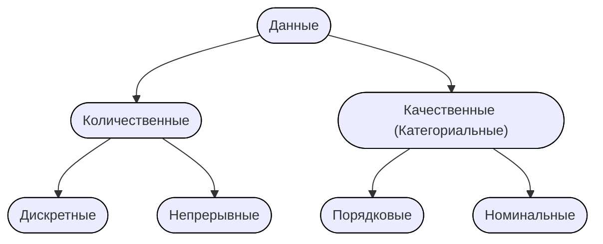
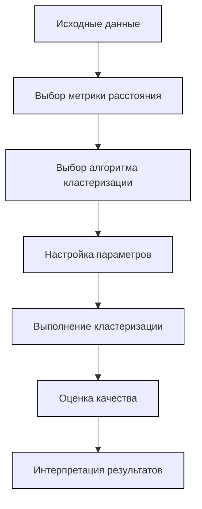

# Тема 1. База
## Типы данных

### Дискретные 
Целые значения.
Обычно результат счёта.
### Непрерывные
float / диапазон.
Обычно результат измерения

### Порядковые
Их нельзя складывать, но можно упорядочить.
S < M < L < XL < XXL
(Label encoding)
### Номинальные
Их нельзя складывать и сравнивать
Бензин $\cancel{ < }$ Дизель
(OneHot encoding)
## Понятие однородности / неоднородности данных
### Бытовое определение
#### Однородные данные
- Имеют одинаковую природу
Сигнал, звук, изображение, изменение по времени какой-либо величины и т.д.
#### Неоднородные
- Смесь типов данных (числовые + категориальные)
- Данные из разных источников (разные страны)
- Данные с разным масштабом (сотни тысяч и десятки единиц)

### Определение в ML
#### Однородные данные
- Каждая строка — независимый объект
- Порядок строк не важен (перемешивание не меняет свойства данных)
- Нет временных или пространственных зависимостей
- Все данные из одного распределения
#### Неоднородные
- Временные зависимости (порядок дней)
- Пространственные зависимости (изображение)
- Групповые зависимости (измерения внутри одного пациента зависимы)
- Разные распределение (данные собраны в разных условиях)
### Как бороться с неоднородностью?
- **Для временных рядов:** Использовать специальные методы валидации (временные разбиения)
- **Для пространственных данных:** Учитывать пространственные autocorrelation
- **Для групповых данных:** Использовать групповую валидацию (GroupKFold)
- **Для разных распределений:** Техники domain adaptation (Перенос знаний с модели на модель)

## Методы предобработки данных
### Missing data
Пропущенные значения
- **Удаление**
	- Потеря информации
- **Заполнение**
	- **Числовые:** Среднее, медиана, мода
	- **Категориальные:** мода или категория *Unknown*
### Encoding
Перевод категориальных данных в количественные
- **Label Ecoding**
	- М, Ж = 0, 1
		- Кодируем каждый признак целым числом
	- Модель может решить, что между числами есть порядок
- **One-Hot encoding**
	- М, Ж = [1, 0], [0, 1]
		- Каждая координата отвечает за конкретное значение. В данном случае первый столбец - $is\_М$, второй - $is\_Ж$
	- Проклятие размерности
		- При большом количестве категорий матрица становится разреженной и большой
### Масштабирование и нормализация
Уменьшение масштаба данных.
- **Стандартизирование**
	- $\dfrac{x - \mu}{\sigma}$
	- Сведение к среднему $\mu = 0$ и стандартному отклонению $\sigma = 1$
- **Min-max**
	- $\dfrac{x - \min}{\max - \min}$
	- Приведение значений к диапазону [0, 1]
	- *Сохраняет исходное распределение*
### Преобразование признаков
Создание новых признаков из существующих для лучшего описания закономерностей.
- **Полиномиальные признаки**
	- Для учёта нелинейных зависимостей
	- $x^{2},\ x^{3},\ x_{1}\cdot x_{2}$
- **Дискретизация**
	- Перевод непрерывного признака в категориальный / интервальный.
	- возраст → [0-18, 19-65, 66+]
- **Извлечение признаков**
	- **Из дат:** день недели, месяц, является ли выходным 
	- **Из текста:** длина, наличие ключевых слов
### Работа с выбросами
Убирание значений, сильно отклоняющихся от остальных наблюдений.
- **Ящик с усами**
	- Берём 25 и 75 перцентиль; отнимаем / прибавляем $1.5 \cdot \operatorname{IQR}$ (интерквартильный размах) (a. k. a. делаем усы); Смотрим, что будет вне границ
		- $\begin{cases}x< Q_{1} - 1.5 \cdot \operatorname{IQR}\ \\ x> Q_{3} + 1.5 \cdot \operatorname{IQR}\end{cases}$
Можем удалить, заменить на предельное значение или же как-то их преобразовать.
## Типы задач, решаемых ИИ
### C учителем
Есть размеченные данные. Пытаемся предсказать правильный ответ
**Задачи:**
- **Регрессия**
- **Классификация**
	- Бинарная, многоклассовая
- **Сегментация**
	- Разделение изображения на смысловые области
- **Ранжирование**
	- Упорядочивание объектов
### Без учителя
Нет размеченных данных. Ищем скрытые структуры
**Задачи:**
- **Кластеризация**
	- Группировка похожих объектов
- **Понижение размерности**
	- Сокращение числа признаков
- **Детекция аномалий**
	- Поиск выбросов
- **Генерация**
	- Создание новых данных (GAN)
### С частичным контролем
Мало размеченных данных + много неразмеченных
- Обычно небольшое количество размеченных данных и большое количество неразмеченных.
- Неразмеченные данные помогают понять структуру пространства, а размеченные - определить границы классов
- Неразмеченные данные дают представление о структуре классифицируемого множества объектов, тогда как размеченные данные определяют классификацию в пределах этой структуры.
### Обучение с подкреплением
Агент учится взаимодействовать со средой и получает "награды" за правильные действия
## Формальная постановка задач
1. **Какие данные есть / могут быть получены?**
2. **Какой тип величины мы можем прогнозировать на основе данных?**
	1. Определение вида задачи
3. **Какой характер данных и зависимостей в них?**
	1. Структура данных, зависимости и их характер
4. **Какие у нас есть ресурсы (технические и человекоресурсы)?**
	1. Время обучения, память, GPU
	2. Эксперты для разметки данных и компетенции команды в ML
	3. Требования к точности и интерпретируемости
	4. Стоимость ошибки (FP, FN)
		1. Лучше, чтобы мы не дали кредит, чем дали и потеряли его.

### Пример формальной постановки
**Задача**: Прогноз оттока клиентов банка
1. **Данные**:
    - 100K клиентов, 50 признаков (возраст, баланс, количество операций)
    - Есть пропуски в данных о доходе
2. **Целевая переменная**:
    - Бинарная: ушел/не ушел (классификация)
3. **Характер данных**:
    - Табличные данные, временные ряды операций
    - Наблюдения независимы (i.i.d.)
    - Признаки: числовые + категориальные
4. **Ресурсы**:
    - Сервер с 16ГБ RAM
    - Модель должна давать ответ < 1 секунды
    - Важна интерпретируемость (чтобы понимать причины оттока)

# Тема 2. Регрессия
https://education.yandex.ru/handbook/ml/article/linear-models
## Постановка регрессии как задачи оптимизации

Пусть дан датасет $(X, y)$, где $y \in R^N$ - вектор целевой переменной, а $X \in R^{N \times M}$ - матрица $M$ признаков.

Задача состоит в подборе линейной функции, "наилучшим образом" моделирующую линейную зависимость ($y = kx + b$) значения таргета $y_i$ от фичи $x_i$. Тогда искомая функция будет иметь вид:
$$f(w,x_i) = (w, x_i) = w_0 + w_1 x_{i1} + w_2 x_{i2} + \cdots + w_N x_{iN} = \hat{y_{i}}$$

Формулировку "наилучшим образом" в данном контексте можно выразить например с помощью Евклидовой нормы:
$$L(f, X, y)=\dfrac{1}{N}\| y - f(w,X) \|^2=\dfrac{1}{N} \sum \limits _{k=1}^N (y_k - (w, x_k))^2$$
Линейная модель тем "лучше" моделирует зависимость чем меньше значение функционала $L$, а значит задача сводится нахождении вектора весов $w^*$, доставляющего минимум функционалу:
$$L_f(w)=\| y - f(w,X) \|^2 \to \underset{w}{\min}$$

## Метрики и функции ошибки задач регрессии

**Функция ошибки** - функционал, используемый во время процесса оптимизации параметров
**Метрика** - функция, оценивающая результат, предсказанный моделью

### Функции ошибок

**1) MSE (Mean Squared Error)**
$$\operatorname{MSE}(y, \hat{y}) = \dfrac{1}{N}\sum\limits_{k=1}^N (y_k - \hat{y_k})^2$$

**2) MAE (Mean Absolute Error)**
$$\operatorname{MAE}(y, \hat{y}) = \dfrac{1}{N}\sum\limits_{k=1}^N |y_k - \hat{y_k}|$$

### Метрики качества

Довольно часто MSE и MAE используют как метрики. Однако на их базе существуют еще несколько метрик:

**1) RMSE**
Квадратный корень MSE

**2) Коэффициент детерминации**
$$R^2 = 1- \dfrac{\sum\limits_{k=1}^N (y_k - \hat{y_k})^2}{\sum\limits_{k=1}^N (y_k - \overline{y})^2}$$
где $\overline{y}$ - среднее обучающей выборки (наилучшее константное предсказание с точки зрения MSE)

**3) MAPE (Mean Absolute Percentage Error)**
$$\operatorname{MAPE}(y, \hat{y}) = \dfrac{1}{N}\sum\limits_{k=1}^N \dfrac{|y_k - \hat{y_k}|}{|y_k|}$$

### Интерпретируемость и применимость метрик

**Интерпретируемость модели** - возможность объяснить её результаты заказчику

**1) MSE**
Интерпретируемость: метрика не ограничена сверху и возвращает значение на порядок большее, чем в данных, из-за чего её сложнее интерпретировать

Применимость: когда выбросов мало и их нужно сильно штрафовать

**2) RMSE**
Интерпретируемость: метрика теперь имеет тот же порядок, что и у данных, потому проще оценить разброс

Применимость: аналогична MSE

**3) MAE**
Интерпретируемость: средняя абсолютная ошибка

Применимость: когда выбросов много (метрика менее им подвержена)

**4) $R^2$**
Интерпретируемость: показывает, какую долю дисперсии модель смогла предсказать
1 - идеальная модель
0 - предсказывает не лучше константного среднего
меньше 0 - предсказывает хуже чем просто среднее

Применимость: когда хотим сравнить модели на одном и том же наборе данных, желательно вместе с другими метриками

**5) MAPE**
Интерпретируемость: средняя ошибка в процентах

Применимость: метрика сильнее штрафует отрицательные величины, данные не должны содержать нули

## Вывод аналитического решения задачи линейной регрессии в векторной форме
при дифференцировании первое слагаемое можно сжато
$$
X_{n \times k} = \begin{pmatrix} 
x_{11} & x_{12} & \ldots &  x_{1k} \\
x_{21} & x_{22} & \ldots & {x_{2k}} \\ 
\vdots  & \vdots & \ddots & \vdots \\ 
x_{n1} & x_{k2} & \ldots & x_{n k}
\end{pmatrix}
$$
$$
\omega = \pmatrix{
\omega_{1} \\
\vdots \\
\omega_{k}
} \quad 
y = \pmatrix{
y_{1} \\
\vdots \\
y_{n}
}
$$
$$
\hat{y} = X \omega
$$
**Функция потерь**
$$
L = (X\omega - y)^{2} \to \min
$$

Преобразуем функцию потерь
$$
L = (X\omega-y)^{T} (X\omega-y) = (X\omega)^{T}X\omega - (X\omega)^{T} y - y^{T}X\omega + y^{T}y
$$

**Используя свойства векторной алгебры получаем тождества**
1. $y^{T}X\omega = (X\omega)^{T}y = \omega^{T}X^{T}y$
2. $(X\omega)^{T}X\omega = \omega^{T} X^{T} X \omega$

С учетом этих свойств, функция потерь принимает вид
$$
L = \omega^{T}X^{T}X\omega - 2\omega^{T}X^{T}y + y^{T}y
$$
Перейдем к решению задачи минимизации. Для этого продифференцируем функцию потерь по вектору весов
$$
\dfrac{dL}{d\omega} = \dfrac{d}{d\omega} \omega^{T}X^{T}X\omega -2 \dfrac{d}{d\omega}\omega^{T}X^{T}y + \dfrac{d}{d\omega}y^{T}y = L_{1} -2 L_{2} + L_{3}
$$
---
$$
w^{T}X^{T}Xw = w^{T} A w = (w_{1},\ldots, w_{k}) \pmatrix{
a_{11} && \ldots && a_{1k} \\
\vdots && \ddots && \vdots \\
a_{k1} && \ldots && a_{kk}
} \pmatrix{w_{1} \\ \vdots \\ w_{k}} =
$$
$$
= \pmatrix{
a_{11}w_{1} + \ldots + a_{k1} w_{k} ,~ \ldots ,~ a_{1k}w_{1} + \ldots + a_{kk} w_{k}
} \pmatrix{w_{1} \\ \vdots \\ w_{k}} =
$$
$$
= w_{1}(a_{11}w_{1} + \ldots + a_{k1} w_{k}) + \ldots + w_{k}(a_{1k}w_{1} + \ldots + a_{kk} w_{k}) = \sum\limits_{i=1}^{k} a_{ii} w^{2}_{i} + 2 \sum\limits_{i=1}^{k} \sum\limits_{j=1}^{i - 1} a_{ij} w_{i}
$$
$$
\dfrac{d}{dw_{2}}\pmatrix{
a_{11}w_{1}^{2} && a_{12}w_{1}w_{2} && \ldots && a_{1k}w_{1}w_{k} \\
a_{21}w_{2}w_{1} && a_{22}w_{2}^{2} && \ldots && a_{2k}w_{2}w_{k} \\
\vdots && \vdots && \ddots && \vdots \\
a_{k1}w_{k}w_{1} && a_{k2}w_{k}w_{2} && \ldots && a_{kk}w_{k}^{2}
} = 2\sum \limits_{ i = 1 }^{ k  } a_{2i}\cdot w_{i} 
$$
Получили квадратичную форму с матрицей $A$. 
С учетом этого получаем
$$
L_{1} = \pmatrix{
2\sum\limits_{i=1}^{k} a_{i1}w_{i} \\
2\sum\limits_{i=1}^{k} a_{i2}w_{i} \\
\vdots \\
2\sum\limits_{i=1}^{k} a_{ik}w_{i}
} = 2A\omega = 2X^{T}X\omega
$$
---
$$
w^{T}X^{T}y = (w_{1}, \ldots, w_{k}) \pmatrix{
x_{11}y_{1} + \ldots + x_{n1} y_{n} \\
\vdots \\
x_{1k}y_{1} + \ldots + x_{nk} y_{n}
} = 
$$
$$
= w_{1} (x_{11}y_{1} + \ldots + x_{n1}y_{n}) + \ldots + w_{k} (x_{1k}y_{1} + \ldots + x_{nk} y_{n})
$$
Таким образом
$$
L_{2} = \pmatrix{
x_{11}y_{1} + \ldots + x_{n1} y_{n} \\
\vdots \\
x_{1k}y_{1} + \ldots + x_{nk} y_{n}
} = X^{T}y
$$
---
$$
L_{3} = 0
$$
*Тривиально*

---
В конечном счете имеем условие экстремума
$$
\dfrac{dL}{d\omega} = 2X^{T}X \omega - 2X^{T} y = 0
$$
Находим оптимальный вектор весов
$$
2X^{T}X \omega - 2X^{T} y = 0
$$
$$
X^{T}X \omega = X^{T} y
$$
$$
\omega = (X^{T}X)^{-1} X^{T} y
$$

## Модели применяемые для решения задачи регрессии

1) АГА ЛОБАНОВ НА ЖУКОВ ДРОЧЕШЬ?!
2) Линейная регрессия
3) Полиномиальная регрессия
4) Дерево решений
	- Разбиваем пространство признаков на области
5) Случайный лес
	- Ансамбль из множества деревьев решений
6) Градиентный бустинг
	- Последовательное построение ансамбля, где каждое новое дерево учится на ошибках предыдущих.
7) Нейронная сеть (без функции активации)
	- Линейные слои без нелинейных активаций эквивалентны линейной регрессии.

## Внесение нелинейности в линейные модели, случаи использования

### Feature Engineering
Идея заключается в интерпретации нелинейного слагаемого как самостоятельной фичи, например:
$$f(w,x)=w_0 + w_1  x_1 + w_2  x_2 + w_3  \ln(x_1) + w_4 x_2^4$$
Мы по приколу ввели несколько нелинейных зависимостей в виде логарифма и четвертой степени, однако относительно весов модель как была линейной, так и осталась.

Увлекаться этим тоже не стоит, ибо есть ~~и~~риски потерять смысл фичи, а плодить юзлесс хуйню дело не благотворное.

Из полезного сюда же можно отнести преобразование периодических фич на окружность: условно у нас есть время суток, день года и т. д., имеет смысл вытащить значения синуса и косинуса для них. Так модели будет проще воспринимать эту фичу (в частности не будет путаницы между 0 и 24-м часами в сутках).

В целом применять стоит, если зависимость видна явно.

### SVR (Support Vector Regressor)
Идея заключается в переходе к более высокой размерности с помощью некоторого ядра так, чтобы в новом пространстве данные стали линейно разделимыми.

Имеет смысл использовать, если зависимость сложна и на глаз сказать какая она нельзя

# Тема 3. Классификация
## Метрики (для бинарной и мультиклассификации)
## ROC AUC
## Гиперпараметр классификации (lr)
## Примеры выбора метрик для бинарной
## Модернизация метрик для задачи мультиклассификации. 
## Примеры выбора метрик для задачи мультиклассификации.
# Тема 4. Деревья
## Построение дерева для классификации (регрессии)
## Критерии останова
## Критерии разбиения (регрессия / классификация)
## Обработка категориальных признаков
# Тема 5. Кластеризация
https://education.yandex.ru/handbook/ml/article/klasterizaciya
## Постановка задачи
Задача **обучения без учителя**, целью которой является разбиение множества объектов на группы (кластеры) таким образом, чтобы:
- Объекты внутри одного кластера были **максимально похожи** друг на друга
- Объекты из разных кластеров были **максимально различны**
$C_{i}$ -кластер. Кластеры не пересекаются
$\mu_i$ — центр кластера $C_i$
$d\left( x_{i}, x_{j} \right)$ - мера близости между объектами.

**Критерий качества:**
- Минимизация внутрикластерного расстояния:  
    $\min \sum \limits_{i=1}^k \sum_{x \in C_i} d(x, \mu_i)^{2}$
- Максимизация межкластерного расстояния:  
    $\max \sum_{i \neq j} d(\mu_i, \mu_j)^{2}$  

**Число кластеров:**
- Может быть задано априори ($k$-means)
- Может определяться автоматически (DBSCAN, иерархическая кластеризация)
## K-means
 ![[kmeans_4a27aaf200_0c3fe72855.gif]]
### Идея
Разбить данные на **k кластеров** так, чтобы минимизировать внутрикластерную вариацию (сумму квадратов расстояний от точек до центроиды их кластера).

### Алгоритм
**Инициализация:**
- Выбираем число кластеров **k**
- Случайно инициализируем **k центроид** (центров кластеров)
**Основной цикл:**
1. **Назначение кластеров (E-step):**
    - Для каждой точки находим ближайшую центроиду
    - Назначаем точку соответствующему кластеру
    - $C_i = {x_j : ||x_j - \mu_i||^2 \leq ||x_j - \mu_l||^2 \ \forall l}$
2. **Пересчет центроид (M-step):**
    - Для каждого кластера вычисляем новую центроиду как среднее всех точек кластера
    - $\mu_i = \dfrac{1}{|C_i|} \sum_{x_j \in C_i} x_j$
3. **Проверка на [[#Критерий остановки|критерий остановки]]**
### Критерий остановки:
- Максимальное число итераций
- Порог изменения центроид
- Порог изменения целевой функции
### Потенциальные проблемы
Кучное размещение центров. В этом случае их начальное положение с большой вероятностью окажется далёким от итогового положения центров кластеров.
### Улучшения алгоритма
**K-means++** (умная инициализация):
1. Первая центроида выбирается случайно
2. Каждая следующая выбирается с вероятностью, пропорциональной квадрату расстояния до ближайшей существующей центроиды
	- $p(s) \cdot \rho{(x_{next}, x_1})^2$
		- $x_{next}$ - последующий центр кластера
		- $x_{1}$ - центр выбранный на шаге 1
		- $p\left( s \right)$ - вероятность выбора точки
- Чем дальше точка тем выше шанс её взять.
- Значительно улучшает качество и скорость сходимости

**mini-batch K-means**
- На каждой итерации выбираем случайную подвыборку (мини-батч) и работаем на ней.
- В случае когда исходная выборка очень велика, переход к пакетной обработке не приводит к большой потере качества, зато значительно ускоряет работу алгоритма.

**Определение оптимального $k$:**
- **Elbow method** - ищем "локоть" на графике $J(k)$

## Иерархические агломерационные и дивизионные методы кластеризации
![[19_4_7ed88aaa93_a97e85a875.webp]]

### Идея
**Агломеративные** алгоритмы начинают с небольших кластеров (обычно с кластеров, состоящих из одного объекта) и постепенно объединяют их в кластеры побольше.
**Дивизионные** начинают с больших кластеров (обычно – с одного единственного кластера) и постепенно делят на кластеры поменьше.

Кластеры могут быть как на одном уровне (плоская структура) так и в иерархии (образуя древовидную структуру)

По мере объединения кластеров, каждой итерации алгоритма соответствует пара объединяемых на этой итерации кластеров, а также расстояние между кластерами в момент слияния. Расстояния с ростом итерации будут только увеличиваться, поэтому возникает возможность построить следующую схему, называемую **дендрограммой**:
![[19_5_64e913b1bf_85496f57cf.webp]]

Пример работы агломеративного алгоритма:
![[68747470733a2f2f64617368656538372e6769746875622e696f2f696d616765732f68696572617263682e676966.gif]]
Здесь по горизонтали внизу отмечены объекты кластеризуемой выборки, под горизонтальной осью подписаны номера объектов, а их расположение вдоль оси продиктовано только эстетическими соображениями: нам удобно строить дендрограмму так, чтобы никакие дуги в ней не пересекались. По вертикали отложены расстояния между кластерами в момент слияния. Когда происходит объединение кластеров, состоящих из нескольких объектов, соответствующая этой итерации алгоритма дуга идёт не до конкретных объектов выборки, а до дуги другого кластера.
**Метод "локтя" по дендрограмме:**
1. Ищем самый длинный вертикальный отрезок, который не пересекается горизонтальными линиями
2. Проводим горизонтальную линию через этот отрезок
3. Число пересекаемых вертикальных линий = число кластеров
### Алгоритм
1. Создаём столько кластеров, сколько у нас объектов в выборке, каждый объект — в своём отдельном кластере.
2. Повторяем итеративно слияние двух ближайших кластеров, пока не выполнится критерий останова.

### Критерий останова
1. Нужное количество кластеров
2. Сильное изменение расстояния после шага итерации

### Подсчёт расстояния
Если обозначить кластеры как $U$ и $V$, расстояние между ними в этом случае можем вычислять по одной из формул:
$d_{avg}(U, V) = \dfrac{1}{|U| \cdot |V|} \sum\limits_{u \in U} \sum\limits_{v \in V} \rho(u,v)$
$d_{min}(U, V) = \min\limits_{(u,v) \in U \times V} \rho(u,v)$
$d_{max}(U, V) = \max\limits_{(u,v) \in U \times V} \rho(u,v)$

### Недостатки:
- **Высокая вычислительная сложность**: O(n³) для наивной реализации, O(n²) с оптимизацией
- **Чувствительность к шуму и выбросам**
- **Не отменяет объединения** (жадный алгоритм)
- **Трудно масштабировать на большие datasets**

## DBSCAN
![[19_6_9cae9e34d3_76ab832434.webp]]
![[68747470733a2f2f64617368656538372e6769746875622e696f2f696d616765732f44425343414e5f7475746f7269616c2e676966.gif]]
### Идея
Выделение связных компонент графа

**Параметры:**
- **$\epsilon$** - радиус окрестности
- **min_samples** - минимальное количество точек в $\epsilon$-окрестности

**Типы точек:**
- **Core point** (ядровая точка):
    - В её $\epsilon$-окрестности находится ≥ min_samples точек (включая саму точку)
- **Border point** (пограничная точка):
    - Не является core point, но попадает в $\epsilon$-окрестность какой-либо core point
- **Noise point** (шумовая точка):
    - Не является ни core, ни border point
### Алгоритм
1. **Инициализация:**
    - Выбираем параметры $\epsilon$ и $\min \operatorname{samples}$
    - Все точки помечаем как не посещённые
2. **Основной цикл:**
    - Для каждой не посещённой точки $p$:
        - Помечаем $p$ как посещенную
        - Находим всех соседей в $\epsilon$-окрестности: $N = \{q ∈ X\ |\ \operatorname{distance}(p,q) ≤ ε\}$
        - Если $|N| < \min \operatorname{samples}$ → помечаем $p$ как **NOISE**
        - Иначе:
            - Создаем новый кластер
            - Добавляем $p$ в кластер
            - Расширяем кластер: добавляем все точки, достижимые из $p$

### Недостатки:
- **Чувствителен к параметрам** $\epsilon$ и min_samples
- **Плохо работает с данными разной плотности** в одном наборе
- **Затруднительно выбирать параметры** в высокоразмерных пространствах
- **Не детерминирован** для border points (могут попасть в разные кластеры)

### Выбор параметров
**Эвристики для $\epsilon$:**
- **K-distance graph**: строим график расстояний до k-го ближайшего соседа (k = min_samples)
- Ищем "локоть" на графике - точка резкого излома

**Эвристики для min_samples:**
- Обычно выбирают min_samples ≥ размерность данных + 1
- Часто используют min_samples = 2 × размерность данных
## Алгоритм нахождения кластеров

по ближайшей центроиде
## Метрики кластеризации
- **Среднее внутрикластерное расстояние.**
	- Мы хотим его **минимизировать**
	- $F_0 = \dfrac{\sum\limits_{i=1}^{n} \sum\limits_{j=i}^{n} \rho(x_i, x_j) \mathbb{I}[a(x_i)=a(x_j)]}{\sum\limits_{i=1}^{n} \sum\limits_{j=i}^{n} \mathbb{I}[a(x_i)=a(x_j)]}$
	- В случае если у кластеров есть центры $\mu _{k}$, часто рассматривается аналогичная метрика — средний квадрат внутрикластерного расстояния:
		- $\Phi_0 = \dfrac{1}{nK} \sum\limits_{k=1}^{K} \sum\limits_{i=1}^{n} \rho(\mu_k, x_i)^2 \mathbb{I}[a(x_i)=k]$
- **Среднее межкластерное расстояние расстояние**
	- Мы хотим его **максимизировать**
	- $F_1 = \dfrac{\sum\limits_{i=1}^{n} \sum\limits_{j=i}^{n} \rho(x_i, x_j) \mathbb{I}[a(x_i) \neq a(x_j)]}{\sum\limits_{i=1}^{n} \sum\limits_{j=i}^{n} \mathbb{I}[a(x_i) \neq a(x_j)]}$
- **Silhouette Score**
	- Показывает насколько в среднем объекты схожи внутри одного кластера и различны с объектами других кластеров.
	- $s(i) = \dfrac{b(i) - a(i)}{\max(a(i), b(i))}$